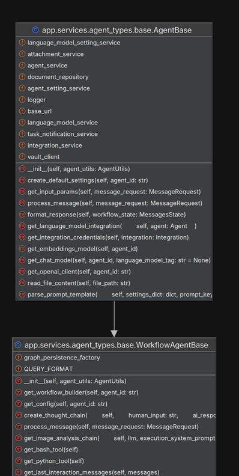
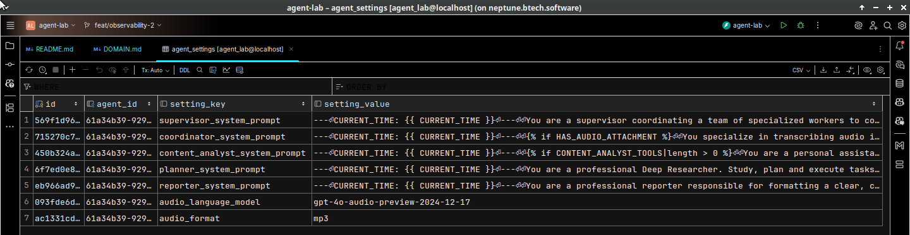

<h2 align="center"><a href="https://github.com/bsantanna/agent-lab">Agent-Lab | 🤖🧪</a></h2>
<h3 align="center">Developer's Guide</h3>

---

#### Table of Contents
- [Setup](#setup)
- [Running the Application](#running-the-application)
- [Development Practices](#development-practices)
- [Building agentic workflows](#building-agentic-workflows)
- [Contributing](#contributing)
- [Production deployment](#production-deployment)

---

## Setup

### Install dependencies

After setting up python environment, install the dependencies with pip package manager. It is recommended to use a virtual environment to avoid conflicts with other projects.:

```bash
pip install -r requirements.txt
```

Make sure **Docker** or another container runtime is installed and running as the application uses docker for integration tests and docker compose for application dependencies.

### Copy the example environment file
Copy the example environment file to `.env` and adjust the settings as needed:

```bash
cp .env.example .env
```

This file contains api keys for various AI suppliers.

---

## Running the Application

### Start the application with Docker Compose

At this time, there are two pre-configured docker compose files:

- `compose-grafana.yaml`: Starts the application with Grafana for observability.
- `compose-opensearch.yaml`: Starts the application with OpenSearch Dashboards for observability.

The following example starts application with Grafana:

```bash
docker compose -f compose-grafana.yaml up --build
```

The following example starts application with OpenSearch Dashboards:

```bash
docker compose -f compose-opensearch.yaml up --build
```

After the application is started, you can access the API at [http://localhost:18000/docs](http://localhost:18000/docs).

Observability dashboards can be accessed at:
- Grafana: [http://localhost:3000](http://localhost:3000) (default credentials: `admin`/`admin`). Please refer to the [Grafana example](otel/GRAFANA.md) for more details.
- OpenSearch Dashboards: [http://localhost:5601](http://localhost:5601). Please refer to the [OpenSearch example](otel/OPENSEARCH.md) for more details.

### Start the application with Uvicorn

For development and debugging with an IDE, you can run the application using Uvicorn:

```bash
uvicorn app.main:app --reload
```

Access the interactive documentation (OpenAPI):

- Swagger UI: [http://localhost:8000/docs](http://127.0.0.1:8000/docs)

---

## Development Practices

### Dependency Injection

The application uses [Dependency Injector](https://python-dependency-injector.ets-labs.org/) for dependency injection. This allows for better separation of concerns and easier testing.

The dependency injection container is defined in `app/core/container.py`. Please use this container to register your dependencies and services.

### Application configuration for development and testing

The application configuration is managed using [Dependency Injector](https://python-dependency-injector.ets-labs.org/). Configuration is defined in YAML files located at projet root difectory. 

- `config-dev.yaml`: Configuration file used for development environment, activated when environment variable `DEVELOPING` is defined, intended to be used with IDE execution for debugging.
- `config-test.yaml`: Configuration file used for testing environment, activated when environment variable `TESTING` is defined, it is used with integration test setup.
- `config-docker.yaml`: Configuration file used with docker compose environment, activated when environment variable `DOCKER` is defined, intended to be used with docker compose execution.

These configuration files define various settings such as database connections, API keys, and other application-specific settings, however they are meant to be used only for development and testing purposes. In production, it is recommended to use [Vault](VAULT.md) to configure the application, please refer to the [Helm charts documentation](CHARTS.md) for more details on how to deploy the application in production.


### Entity Domain Model

Please refer to the [Entity Domain Model](DOMAIN.md) for details on the data model used in the application. This model is used to define the entities and their relationships in the application.


### Logging and Observability

The application uses [OpenTelemetry](https://opentelemetry.io/) for logging and observability. The configuration is defined in `app/infrastructure/metrics/tracer.py`.

Please refer to the [OpenTelemetry documentation](OTEL.md) for more details on the implementation.


### Testing

The application uses [pytest](https://docs.pytest.org/en/stable/) for testing, with a focus on integration testing practices, with goal of 90%+ coverage.

Test dependencies are supported by [Testcontainers](https://testcontainers-python.readthedocs.io/en/latest/), which allows for running tests against real services in Docker containers.

The tests are located in the `tests/integration` directory.

Use the following command to run the tests:

```bash
make test
```

**Note:** The first execution can take several minutes as it will download the required resources like docker images and embedding models.

### Initialize pre-commit

If you plan to contribute to the codebase or build new agents on top of Agent-Lab, it is recommended to install the pre-commit hooks:

```bash
pre-commit install
```

This will ensure that your code follows the project's coding standards and runs the tests before committing.

---

## Building agentic workflows

Agent-Lab is built on top of the [LangGraph](https://www.langchain.com) framework, which provides a powerful way to build agentic workflows using LLMs.

Building agentic workflows is a straightforward process in Agent-Lab, thanks to its modular architecture and the use of LangGraph.

### Define a new Agent implementation

**Agent** is a core concept in Agent-Lab, representing an autonomous entity that can perform tasks, make decisions, and interact with other agents or external systems.

An **agent** is also a concrete implementation of the following base classes:

<div align="center">



</div>

A class that extends `WorkflowAgentBase` should define:
- a [workflow](https://langchain-ai.github.io/langgraph/how-tos/graph-api/) that represents the agent's behavior. This workflow can include various tasks, decision-making processes, and interactions with other agents or external systems.
- initialization parameters for the agent such as the prompts (defined as jynja2 templates) and other settings that can be used to customize the agent's behavior, such as vector store collections, temperature or other setting that support the agent functionality.

Here is an example of a set of persisted initialization parameters for an agent that performs voice transcription and analysis after an agent is created and stored in the database:

<div align="center">



</div>

Multiple agents with the same reference implementation can be created and further refined via the REST API.

### Register the Agent in dependency injection container

Adapt the dependency injection container to register the new agent class. This allows the application to manage the agent's lifecycle and dependencies and use factory methods to build the workflow with customized prompts and settings recovered from database.

The dependency injection container is defined in `app/core/container.py`, please include new agent implementation there.

As an additional requirement, the agent class should be registered in the `app/services/agent_types/registry.py` class, this way agents can be resolved by a key called `agent_type` which is used to identify the agent implementation.

### Add agent type to Pydantic validation schema

The agent type should be added to Pydantic validation schema in `app/interface/api/agents/schema.py`. This allows the API to validate the agent type when creating or updating agents.


### Experimenting the agent implementation

Please refer to the [notebooks](/notebooks) for examples of how to test the agent implementation using Jupyter notebooks. These notebooks provide a convenient way to interact with the agents and test their behavior in a controlled environment leveraging over the same dependency injection mechanism.


### REST API agent interface

While experimenting with Jupyter notebooks is a great way to quickly prototype and validate agent implementations, the main way to interact with agents in Agent-Lab and configured **agent** implementations is through the REST API.
Assuming the agent implementation is properly registered and validation schema is updated, you can create multiple agent instances of given implementation using the REST API.
Please refer to the [API documentation](http://localhost:18000/docs) for details on how to create, update, and delete agents.
A overall introduction can be found in this repository [REST API section](REST_API.md).

### Integration testing

Please refer to the [integration tests](/tests/integration) for examples of how to test the agent implementation using pytest. These tests provide a way to ensure that the agent behaves as expected.

### MCP Server

Please refer to the [MCP Server documentation](MCP.md) for more details on how to use the MCP server to configure agent discovery, dialog history, and agent-to-agent communication.

---

## Contributing

To contribute to the project, follow these steps:

1. Fork the repository.
2. Create a new branch for your feature or bugfix.
3. Activate the pre-commit hooks by running `pre-commit install`, make your
   changes, and commit them with clear and concise messages.
4. Ensure your changes pass the pre-commit hooks and achieve at least 80% test
   coverage in SonarQube.
5. Push your changes to your forked repository.
6. Create a Pull Request (PR) to the `main` branch of the original repository.

We will review your PR and provide feedback.
Thank you for your contributions and support!

---

## Production deployment

Please refer to the [Helm charts documentation](CHARTS.md) for more details on how to deploy the application in production using Helm charts.
