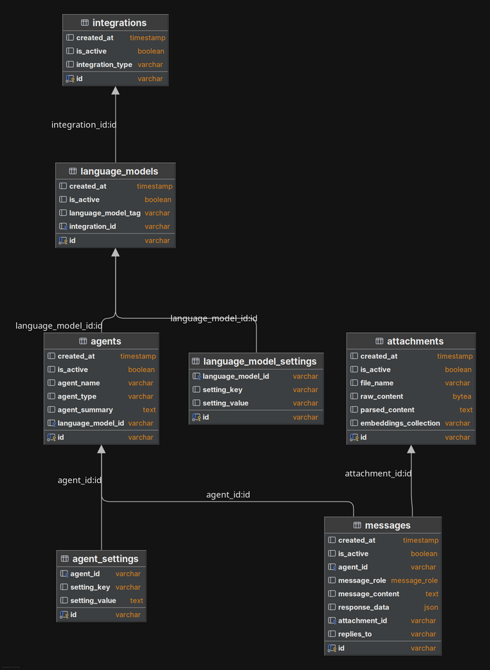

<h2 align="center"><a href="https://github.com/bsantanna/agent-lab">Agent-Lab | 🤖🧪</a></h2>
<h3 align="center">Entity domain model</h3>

---

---
## Entities:

The following entities are defined in the domain model:

- **Agent**: Represents an LLM agent with its specific settings and configurations.
- **AgentSettings**: Stores agent-specific configuration parameters with key-value pairs.
- **LanguageModel**: Defines the language models available for agents to use.
- **LanguageModelSettings**: Contains specific settings and parameters for language models.
- **Integration**: Manages external integrations and their configurations.
- **Messages**: Stores conversation messages, including roles, content, and response data.
- **Attachments**: Handles file attachments with raw content, parsed content, and embeddings collection references.

Here an example of agent settings containing prompts and custom values for an agent [example implementation](/notebooks/08_test_agent_type-multiagent-voice-assistant.ipynb):

### Security and Secrets Management:

Secrets are managed using [Vault](VAULT.md), ensuring secure storage and retrieval of sensitive information like API keys.
