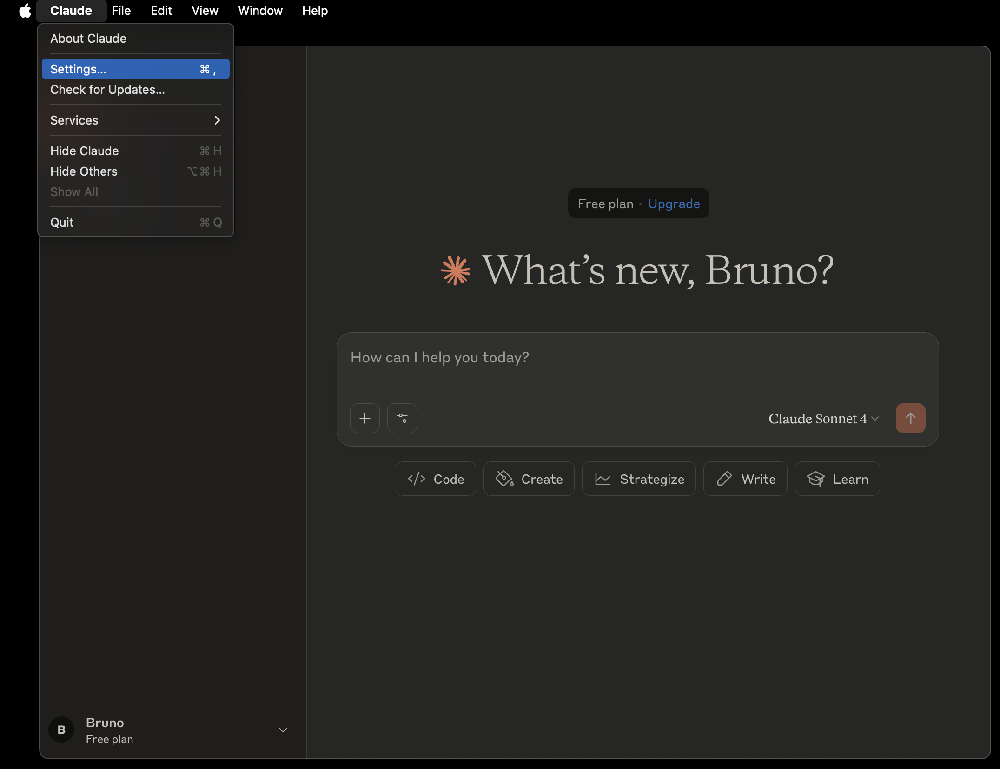
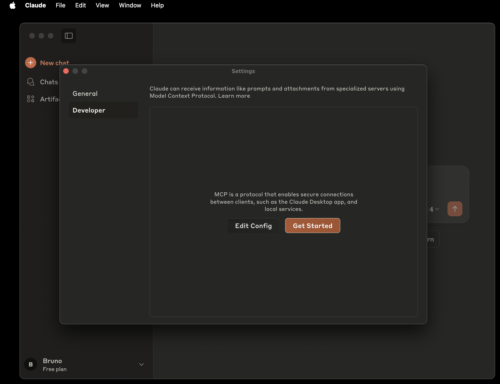
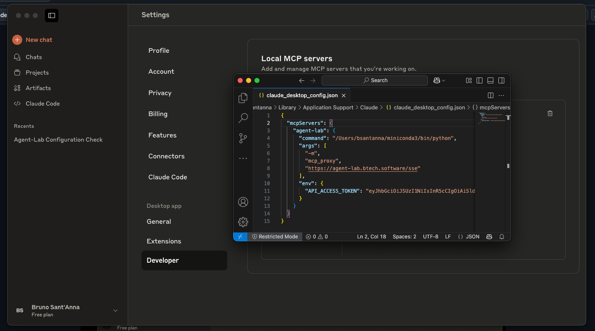
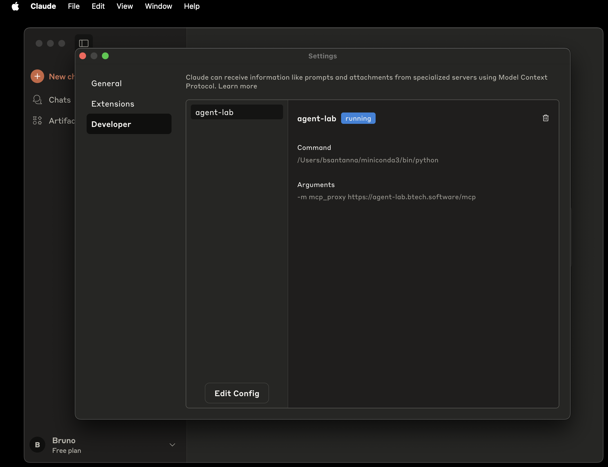
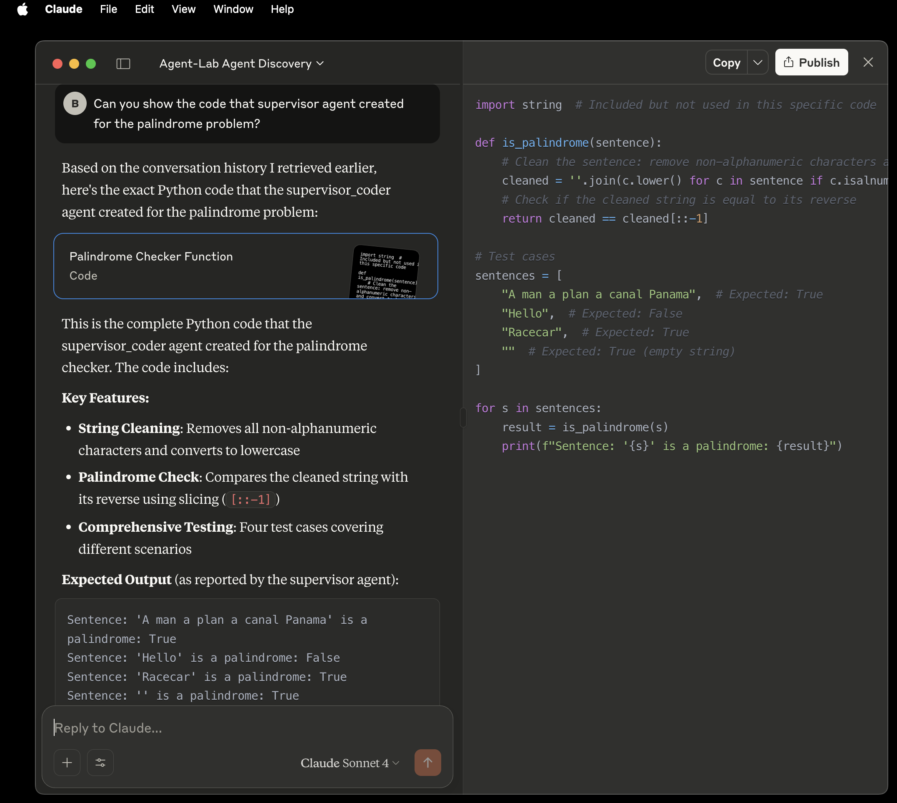

<h2 align="center"><a href="https://github.com/bsantanna/agent-lab">Agent-Lab | 🤖🧪</a></h2>
<h3 align="center">MCP Server</h3>

---

## Introduction

Agent-Lab features a [MCP Server](https://modelcontextprotocol.io/introduction) that exposes tools for agent discovery, dialog history and agent-to-agent communication.

The application integrates with [FastAPI-MCP](https://github.com/tadata-org/fastapi_mcp).


---


## MCP Inspector Demo

Start [MCP Inspector](https://github.com/modelcontextprotocol/inspector)

```bash
npx @modelcontextprotocol/inspector
```

Access Web console (use link with proxy given in the console).

<div align="center">


</div>

---

## Claude Desktop Integration

**Note**: Claude Desktop is used only for demonstration purposes. This project is not affiliated with Anthropic AI.

### Install mcp-proxy dependency

The [mcp-proxy](https://pypi.org/project/mcp-proxy/) is used by Claude Desktop to connect to remote HTTP servers.

```bash
pip install mcp-proxy
```

### Configure MCP Server in Claude Desktop

1. Open Settings window

<div align="center">



</div>

2. Under *Developer* section, click *Edit Config*

<div align="center">



</div>

3. Edit the file `claude_desktop_config.json`
  - python environment should contain the module *mcp-proxy* installed
  - adapt the endpoint to your custom installation, please refer to [developer's Guide](DEV_GUIDE.md) for more details.

<div align="center">



</div>

4. Restart Claude Desktop and navigate again to *Settings* -> *Developer*, Agent-Lab should be visible:

<div align="center">



</div>


### Claude Desktop Demo

The following example shows MCP Server discovering and obtaining dialog history of a [supervised coder agent](/notebooks/05_test_agent_type-multiagent-coder.ipynb) instance:

<div align="center">


</div>

Another Example, asking to show code snippet generated by The following example shows MCP Server discovering and obtaining dialog history of a [supervised coder agent](/notebooks/05_test_agent_type-multiagent-coder.ipynb) instance in a previous interaction:


<div align="center">



</div>

--

## OpenAI Responses API Notebook

> The hosted Model Context Protocol (MCP) tool in the Responses API makes this (connecting to external services) easier. Instead of manually wiring each function call to specific services, you can configure your model once to point to an MCP server (or several!). That server acts as a centralized tool host, exposing standard commands like “search product catalog” or “add item to cart.” This allows for simpler orchestration and centralized management of tools. With MCP, the model interacts directly with the MCP server, reducing latency and eliminating backend coordination.
- [Source: MCP Tool Guide](https://cookbook.openai.com/examples/mcp/mcp_tool_guide)

A Notebook demonstrating the integration of OpenAI Responses API with Agent-Lab MCP Server is available at [notebooks/11_mcp_client-openai-responses.ipynb](/notebooks/11_mcp_client-openai-responses.ipynb).

